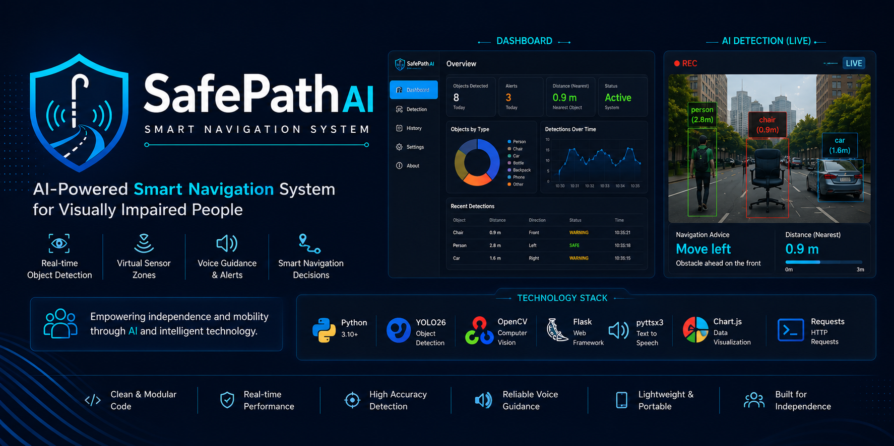
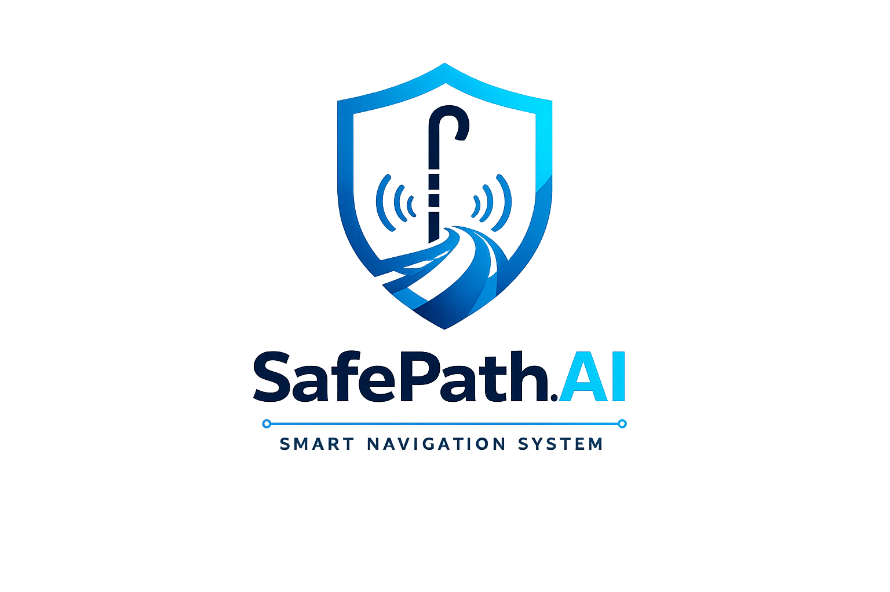
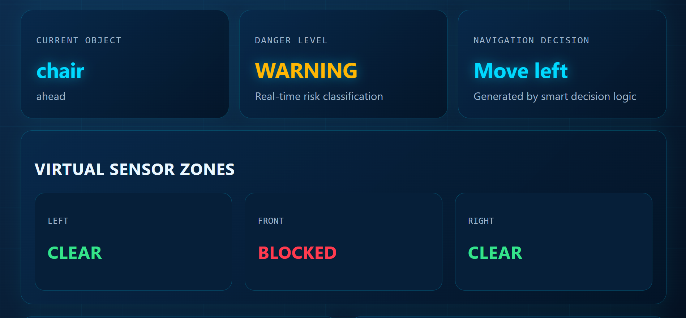
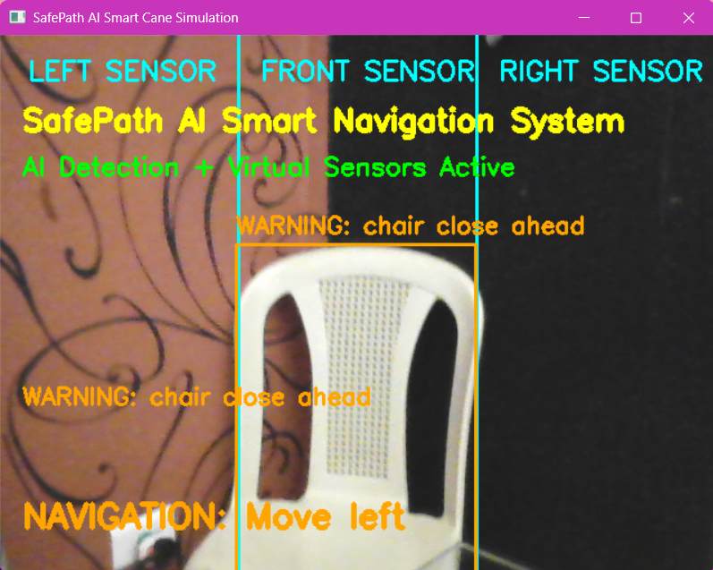
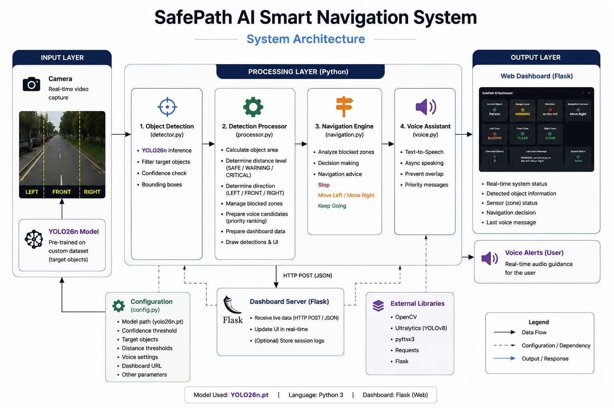
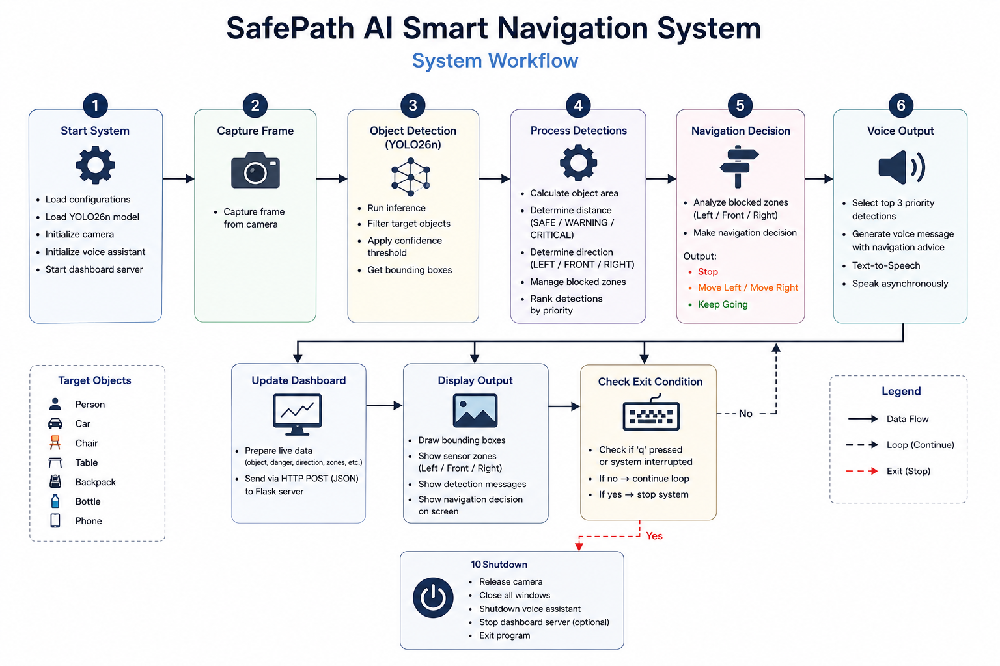

<p align="center">
  
</p>

<p align="center">
  
</p>

<h1 align="center">🦯 SafePath AI</h1>

<p align="center">
An AI-powered Smart Navigation System that assists visually impaired people through real-time object detection, intelligent navigation decisions, and voice guidance.
</p>

<p align="center">


</p>

---

# 📖 Overview

SafePath AI is a computer vision-based navigation system developed to improve accessibility and independent mobility for visually impaired individuals.

Using a live camera feed, the system detects surrounding obstacles with the YOLO26n object detection model, evaluates their positions, and provides real-time navigation guidance through voice alerts while displaying system information on a Flask-based monitoring dashboard.

The project was designed as a modular software prototype that can be extended into a future embedded hardware solution.

---

## 📑 Table of Contents

- Overview
- Highlights
- Project Preview
- Project Goal
- System Architecture
- System Workflow
- Technologies
- Quick Start
- Project Structure
- Documentation
- Current Capabilities
- Future Roadmap
- License
- Author

# ✨ Highlights

- 🎯 Real-time object detection
- 🧠 AI-powered obstacle analysis
- 🧭 Intelligent navigation assistance
- 📢 Voice guidance using Text-to-Speech
- 🚨 Multi-level danger assessment
- 📊 Live monitoring dashboard
- ⚡ Real-time dashboard synchronization
- 🏗️ Modular and scalable architecture
- 🔌 Ready for future embedded integration

---

# 📸 Project Preview

## Dashboard

<p align="center">

</p>

The dashboard displays live system information including detected objects, navigation status, danger level, and overall system activity.

---

## Object Detection

<p align="center">

</p>

The detection interface visualizes real-time object recognition, obstacle locations, confidence scores, and navigation guidance generated by the AI model.

---

# 🎯 Project Goal

The objective of SafePath AI is to demonstrate how Artificial Intelligence and Computer Vision can be integrated into assistive technologies to provide safer navigation support for visually impaired people.

This project focuses on building a software prototype that combines real-time object detection, intelligent decision-making, and user-friendly feedback in a scalable architecture suitable for future hardware implementation.

---
# 🏗️ System Architecture

<p align="center">

</p>

SafePath AI follows a modular software architecture that separates object detection, navigation logic, dashboard communication, and voice guidance into independent components. This design improves code organization, maintainability, and future scalability.

📖 **Detailed technical documentation:**  
➡️ `docs/architecture.md`

---

# 🔄 System Workflow

<p align="center">

</p>

Each camera frame passes through a real-time processing pipeline, starting from object detection and ending with navigation guidance and dashboard updates. This workflow enables continuous obstacle monitoring and user assistance.

📖 **Detailed workflow documentation:**  
➡️ `docs/workflow.md`

---

# 🛠️ Technologies

| Category | Technologies |
|----------|--------------|
| Programming Language | Python |
| AI Model | YOLO26n |
| Computer Vision | OpenCV |
| Backend | Flask |
| Dashboard Communication | Flask-CORS, Requests |
| Voice Assistance | pyttsx3 |
| Front-End | HTML, CSS, JavaScript |

---

# 🚀 Quick Start

Clone the repository

```bash
git clone https://github.com/FCHGIT93/SmartCaneAI.git
```

Navigate to the project directory

```bash
cd SmartCaneAI
```

Install the required packages

```bash
pip install -r requirements.txt
```

Run the dashboard

```bash
python dashboard.py
```

Open a new terminal and start the navigation system

```bash
python safepath.py
```

📖 **Complete installation guide:**  
➡️ `docs/installation.md`

---

# 📁 Project Structure

```text
SmartCaneAI/
│
├── assets/
├── docs/
├── models/
├── safepath_core/
├── static/
├── templates/
│
├── dashboard.py
├── safepath.py
├── requirements.txt
├── README.md
└── .gitignore
```

📖 **Complete folder and module description:**  
➡️ `docs/project-structure.md`

---

# 📚 Documentation

The repository includes additional technical documentation for users and developers.

| Document | Purpose |
|----------|---------|
| architecture.md | Explains the overall system architecture |
| workflow.md | Describes the complete processing workflow |
| installation.md | Provides detailed installation instructions |
| project-structure.md | Explains the purpose of each folder and module |
| future-work.md | Presents planned future enhancements |

---
# 🎯 Current Capabilities

SafePath AI currently provides the following functionalities:

- Real-time object detection using the YOLO26n model
- Obstacle localization (Left, Front, Right)
- Multi-level danger assessment
- Intelligent navigation guidance
- Real-time voice notifications
- Live dashboard monitoring
- Continuous camera processing
- Modular software architecture for future expansion

---

# 🛣️ Future Roadmap

The current implementation represents a software prototype. Future versions of the project may include:

- Raspberry Pi deployment
- Ultrasonic sensor integration
- GPS navigation support
- Bluetooth earphone connectivity
- Mobile application
- Emergency SOS feature
- Outdoor navigation optimization
- Custom-trained YOLO26n model
- Cloud synchronization and remote monitoring

📖 **Complete future development plan:**  
➡️ `docs/future-work.md`

---

# 📄 License

This project is released under the **MIT License**.

You are free to use, modify, and distribute this project in accordance with the terms of the license.

---

# 👩‍💻 Author

**Fatima Chakaron**
**Chaza Aboulhosn**
**Mariam Mahfouz**

Fourth-Year Computer and Communication Engineering Students  
Islamic University of Lebanon (IUL)

### GitHub

https://github.com/FCHGIT93

---

# 🙏 Acknowledgements

This project was developed as part of an academic engineering project to demonstrate the practical integration of Artificial Intelligence, Computer Vision, and Web Technologies in assistive systems for visually impaired individuals.

Special thanks to the open-source community and the developers of the technologies that made this project possible, including Python, OpenCV, Flask, and the Ultralytics ecosystem.

---

<p align="center">

<strong>SafePath AI</strong><br>

Building smarter and more accessible navigation through Artificial Intelligence.

</p>
